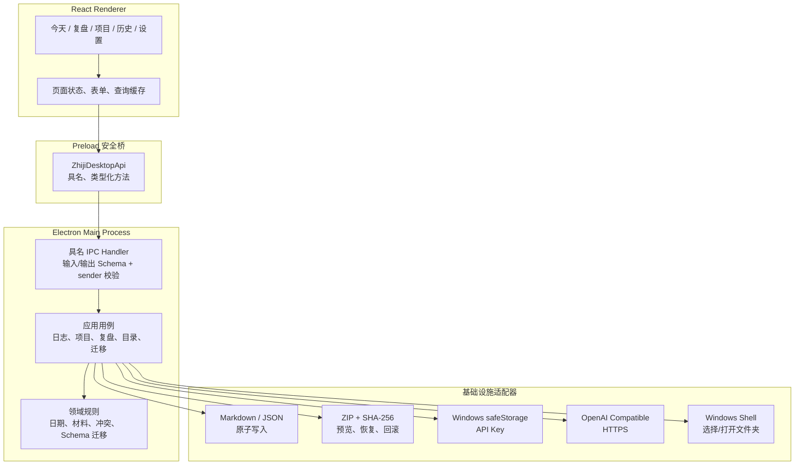

# 知己 Windows 桌面端产品与技术架构审计

> 审计日期：2026-08-13
>
> 审计性质：已确认的产品审计与 P0 规划依据，不代表功能已经实现
>
> 证据口径：桌面客户端代码以 `codex/zhiji-windows-desktop-impl` 工作树为代码事实；项目治理状态以审计时 `main` 分支的 `README.md`、`PROJECT_STATUS.md`、`CHANGELOG.md` 为准
> 结论标签：`代码实测`、`文档事实`、`市场资料`、`产品推断`

## 1. 执行摘要：最重要的 3 个结论

### 1.1 无需新增第六个一级页面，当前五页足够

**标签：代码实测、产品推断**

“今天、复盘、项目、历史、设置”已经覆盖三个核心任务：记录并得到反馈；回看、复盘和验证；管理 AI、数据与迁移。当前复杂感不是功能数量不足，而是首次引导、真实数据路径、反馈后的下一步和低频数据入口没有形成完整闭环。

主要证据：

- `apps/zhiji-desktop/src/renderer/app/navigation.ts` 定义五个入口。
- `apps/zhiji-desktop/src/renderer/app/app.tsx` 首次启动直接进入“今天”，没有 onboarding 状态。
- `apps/zhiji-desktop/src/renderer/pages/settings-page.tsx` 已包含 AI 和备份功能，但不显示真实数据路径，也不能打开或迁移数据目录。

建议保留五页，把设置页明确重组为“AI 服务、数据与备份、个人背景”；隐私边界直接放在相关分区内说明，诊断能力以后按真实故障证据再补。侧栏底部的数据状态改为可点击入口，无需新增“数据与备份”一级页面。

### 1.2 最优先不是增加报告，而是补齐数据掌控闭环

**标签：代码实测、产品推断**

当前已有 Markdown/JSON 本地存储、原子写入、SHA-256 备份清单、ZIP 路径白名单、Windows `safeStorage` 凭据隔离和空目录恢复。但以下硬要求尚未满足：

- 前端看不到当前数据目录的真实路径。
- 不能一键打开数据文件夹。
- 不能在 UI 中修改和迁移数据目录，但这不是完成首个可用版本的前置条件。
- 不能把备份合并到已有数据或处理内容冲突，但当前空目录恢复足以先完成可迁移闭环。
- 导入会校验清单、路径、大小和哈希，但未逐文件执行 Journal、Review、Project 业务 Schema 校验。
- 没有最小个人资料的明确存储位置、查看、编辑、导入、导出和清空入口。
- 现有 Electron E2E 只覆盖项目、日志保存与历史读取，没有覆盖 AI 反馈、周期复盘和备份恢复。

因此 P0 的边界是：真实路径可见且可打开、最小个人资料可掌控、备份在写入前完成业务 Schema 校验、完整主流程可自动验证。运行中迁移目录、合并恢复、缓存和诊断中心均后移。

主要证据：

- `apps/zhiji-desktop/src/main-process/bootstrap.ts`
- `apps/zhiji-desktop/src/main-process/infrastructure/transfer/data-transfer-service.ts`
- `apps/zhiji-desktop/e2e/desktop.spec.ts`

### 1.3 继续采用 Electron + React + TypeScript 模块化单体

**标签：代码实测、市场资料、产品推断**

现有架构已经实现 Renderer、Preload、Main Process、文件存储、凭据和 AI Provider 的分层。当前问题是产品入口与数据透明，而不是运行时无法承载需求，因此不应重写为 Tauri，也没有必要增加本地服务进程。

Electron 官方安全文档建议启用上下文隔离、Renderer 沙箱、为每个 IPC 暴露单独方法并校验 IPC sender。当前实现具备前三项的主体结构，但仍需补 sender 校验、自定义本地协议评估和统一运行时响应校验。

Tauri 的较小安装包和 Rust 安全优势真实存在，但其 Windows 开发需要 Rust、Microsoft C++ Build Tools 和 WebView2，迁移不能直接改善当前产品问题。招聘样本只能证明 React、TypeScript、Node.js 和现代前端工程实践具有广泛岗位相关性；Electron 应视为桌面工程加分项，不能声称它本身是大量岗位的主流要求。

市场来源：

- [Electron Security](https://www.electronjs.org/docs/latest/tutorial/security)，核验于 2026-08-13。
- [Electron Context Isolation](https://www.electronjs.org/docs/latest/tutorial/context-isolation)，核验于 2026-08-13。
- [Electron safeStorage](https://www.electronjs.org/docs/latest/api/safe-storage)，核验于 2026-08-13。
- [Tauri 官方介绍](https://v2.tauri.app/start/)，页面更新于 2026-07-22。
- [Tauri Windows 前置条件](https://v2.tauri.app/start/prerequisites/)，页面更新于 2026-03-30。
- [2026 校园招聘样本](https://career.cuhk.edu.cn/attachment/careercuhk/ueditor/file/20260515/2071_%E7%86%B5%E5%9F%BA%E5%BE%8B%E5%8A%A8%20-%202026%E6%A0%A1%E5%9B%AD%E6%8B%9B%E8%81%98.pdf)：React/Vue、TypeScript、Node.js、CI/CD。

## 2. 当前产品审计：保留、简化、补齐、暂缓

### 2.1 能力审计

| 范围 | 判断 | 当前事实与调整方向 |
| --- | --- | --- |
| 今天 | 保留并强化 | 已支持项目选择、日志保存、日反馈、最近记录和上次行动；生成后应原位展示结果，而不只提示去历史 |
| 复盘 | 保留 | 已有周、月、项目复盘及材料预览；日期配置应按需展开 |
| 项目 | 保留并简化术语 | 已支持新建、归档和关联日志统计；“项目与材料”应改为“项目与关联日志”，避免暗示已有附件能力 |
| 历史 | 保留 | 已支持类型、项目和文本筛选；应补源文件入口和损坏文件隔离 |
| 设置 | 保留但重组 | AI 配置和备份已存在；P0 补数据路径、打开目录、备份边界、个人背景和隐私说明；目录迁移后移 |
| 日/周/月/项目复盘 | 保留 | 已有代码闭环，无需重复开发 |
| 年报 | 暂缓 UI | 客户端 Schema 尚无 `yearly`；主项目年度链路仍缺足够材料验证 |
| 个人资料 | **P0 补齐最小显式模型** | CLI 侧已有“关于我”，客户端没有 Profile 模型或入口；用户已明确要求知道资料在哪里并能导入导出 |
| 备份业务校验 | **P0 补齐** | 当前只验证传输完整性，尚不能证明恢复后的 Journal、Review、Project、Profile 可被业务读取 |
| 项目附件 | P2 | 当前只有关联日志，尚无真实需求证据支持近期开发附件管理 |
| 数据目录迁移 | P1 | 当前只有环境变量覆盖，普通用户无法操作 |
| 合并恢复 | P1 | 当前只支持恢复到空目录 |
| 云同步、账号、多用户 | 明确不做 | 与 Windows 本地单用户定位冲突 |

### 2.2 复杂感的根因

**标签：产品推断，依据页面和 IPC 代码**

1. 保存和生成有即时提示，但缺少持续可见的真实数据路径、文件结果和明确下一步。
2. 首次用户必须自行推断先配置 AI、再返回今天页写日志。
3. 产品声称“数据留在本机”，但没有把路径、打开目录、备份边界变成可操作界面。
4. 用户个人资料没有固定位置和前端入口，用户无法确认 AI 可能使用什么背景信息。
5. “项目与材料”比真实能力更宽，用户可能误以为支持附件。
6. 错误多以底层消息直接显示，没有统一映射为用户能执行的恢复动作。
7. 测试数量较完整，但真实 E2E 尚未证明整个用户闭环可一次走通。

### 2.3 第一性原理复核

**标签：产品推断**

用户最核心的三个任务：

1. 把今天发生的事安全记录下来，并得到一个可验证反馈。
2. 从一段时间或一个项目中看见规律，并决定下一步。
3. 确信数据属于自己，能找到、备份并搬走。

最短操作与当前摩擦：

| 任务 | 最短主步骤 | 当前额外摩擦 |
| --- | --- | --- |
| 日志反馈 | 写内容 → 保存并生成 | 首次不知道先配置 AI；结果不原位展示 |
| 周/月/项目复盘 | 选择类型 → 确认材料 → 生成查看 | 日期配置过早暴露；成功后仍需去历史查找 |
| 数据掌控 | 看路径 → 打开目录或导出 → 校验/恢复 | 路径不可见；不能打开目录；只支持空目录恢复 |

用户最担心失去或找不到的资产依次是：原始日志、日反馈和长期复盘、项目关系、个人长期背景。API Key 重要但可以重新配置，不应混入内容数据和备份包。

必须始终可见：本地保存状态、AI 是否可用、当前数据目录入口、AI 生成任务状态。按需展开：自定义 Base URL、模型高级设置、备份清单、冲突逐项处理、诊断信息和 Schema 版本。

## 3. 核心用户旅程与信息架构

### 3.1 产品定位

**标签：产品推断**

> 知己是一款面向希望从日常记录中形成可验证行动的 Windows 本地 AI 复盘工具；日志和复盘由用户掌控，AI 只负责分析，不接管数据。

目标用户：愿意记录日常、复盘项目或观察长期行为，但不愿学习 CLI、Skill、Agent 和 Markdown 工程结构的 Windows 单用户。

明确不做：Android、Web SaaS、多用户、账号、云同步、自动替用户归类、医疗或心理诊断、微服务、云数据库和复杂协作。

### 3.2 最短闭环


| 步骤 | 入口 | 成功反馈 | 失败恢复 | 下一步 |
| --- | --- | --- | --- | --- |
| 首次打开 | 直接进入今天 | 页面内只提示当前缺失项 | 不设置阻塞式向导；未配置 AI 仍可保存日志 | 写日志或处理提示 |
| 确认数据位置 | 侧栏底部、设置、首次内联提示 | 显示真实绝对路径并可打开；确认后不再打扰 | 路径不可用时解释原因，不在 P0 提供迁移 | 配置 AI或继续记录 |
| 配置 AI | 今天页条件提示或设置 | 连接成功，Key 已由 Windows 安全存储保护 | 区分 Key、模型、限流、余额、超时、断网 | 返回今天 |
| 写日志/选项目 | 今天 | 草稿和项目关系清晰 | 项目不可用时可不关联继续 | 保存 |
| 保存 | 今天主操作 | 显示已保存文件与打开目录入口 | 保留编辑内容并允许重试 | 生成反馈 |
| 生成反馈 | 今天 | 原位显示摘要并确认已落盘 | 保留已保存日志，提供重试或去设置 | 查看完整反馈 |
| 查看历史 | 今天结果或历史 | 定位本次日志/反馈 | 文件损坏时指出文件且不阻塞其他内容 | 发起复盘 |
| 周/月/项目复盘 | 复盘或项目详情 | 先预览材料，生成后原位展示 | 材料不足时说明缺口且不调用 AI | 备份 |
| 备份或恢复 | 设置 → 数据与备份 | 显示路径、数量、业务完整性校验 | 失败不改变原数据 | 打开备份位置 |

### 3.3 信息架构决定

保留五个一级入口：

```text
今天
复盘
项目
历史
设置
  ├─ AI 服务
  ├─ 数据与备份
  └─ 个人背景
```

“数据与备份”不独立成第六页，因为它是低频管理任务，设置页已有实现基础，并可通过侧栏全局状态卡提高可见性。只有真实用户数据显示其成为高频任务时，才重新评估一级入口。

## 4. 页面级规划

### 4.1 今天

- 唯一主要任务：完成“记录—保存—反馈—验证”。
- 主操作：保存并生成反馈。
- 次操作：仅保存、关联项目、查看上次行动、查看完整历史。
- 默认状态：今日日志编辑器、上次行动和本周闭环摘要。
- 空状态：说明真实记录即可，提供一个短例子。
- 加载状态：区分保存和生成；生成允许取消。
- 错误状态：保留正文，根据错误提供重试、去设置或仅保存。
- 成功状态：原位展示反馈摘要、文件状态和查看完整反馈入口。
- 不应显示：复盘高级参数、Base URL、Token 预算和内部 prompt。
- 渐进展开：关联项目为可选，高级写作提示折叠。

现有代码：`apps/zhiji-desktop/src/renderer/pages/today-page.tsx`。

### 4.2 复盘

- 唯一主要任务：从确认过的材料生成一次有来源的周期判断。
- 主操作：选择周/月/项目 → 预览材料 → 确认生成。
- 次操作：调整范围、切换项目、查看已有复盘。
- 默认状态：三种复盘卡，强调先周报再月报。
- 空状态：说明缺少哪些日期或项目材料，并引导去今天或项目。
- 加载状态：材料读取与 AI 生成分开显示。
- 错误状态：预览失败不调用 AI；生成失败保留预览。
- 成功状态：原位显示结果摘要和来源数量，再提供历史入口。
- 渐进展开：周/月默认使用标准周期，只有调整时才显示日期。
- 年报：近期不显示第四张卡，数据模型预留未来扩展即可。

现有代码：`apps/zhiji-desktop/src/renderer/pages/reviews-page.tsx`。

### 4.3 项目

- 唯一主要任务：组织某个长期目标下的日志关系。
- 主操作：新建项目、从项目详情发起复盘。
- 次操作：归档、查看关联日志、跳转历史。
- 默认状态：进行中项目优先，归档项目折叠。
- 空状态：解释项目是可选整理方式，不阻塞日志。
- 成功状态：创建后自动选中；归档后明确日志未删除。
- 应显示：关联日志数量、最近活动、最近关联记录。
- 不应显示：“材料”这一暗示任意附件的宽泛术语。
- 跳转：关联日志进入历史；项目复盘带入项目 ID。

现有代码：`apps/zhiji-desktop/src/renderer/pages/projects-page.tsx`。

### 4.4 历史

- 唯一主要任务：找到并阅读过去的日志与复盘。
- 主操作：选择记录并阅读。
- 次操作：搜索、按类型和项目筛选、打开源文件或所在目录。
- 默认状态：最新记录优先，左侧列表、右侧阅读。
- 空状态：区分完全无记录和筛选无结果。
- 错误状态：指出损坏文件，但其他文件仍可浏览。
- 应显示：类型、日期、项目和可理解的来源。
- 不应默认显示：内部 ID、prompt 版本等技术字段。
- 渐进展开：技术元数据放详情抽屉。

现有代码：`apps/zhiji-desktop/src/renderer/pages/history-page.tsx`。

### 4.5 设置

- 唯一主要任务：让用户掌控 AI、数据和隐私。
- 页面分区：AI 服务、数据与备份、个人背景；隐私说明随 Key、备份和个人资料就近呈现。
- 默认状态：显示 AI 是否可用、数据目录和最近备份状态。
- 空状态：未配置 AI 时给最短配置路径。
- 加载状态：AI、目录、备份独立加载，不阻塞整页。
- 错误状态：测试、保存、导出、预览、恢复分别显示。
- 数据区必须显示真实路径、打开文件夹、备份包含/排除项、导出和空目录恢复；修改目录标为后续能力。
- 个人背景区必须显示资料文件位置，并支持查看、编辑、启停、导入、导出和清空。
- 高级项折叠：自定义 Base URL、模型名；诊断中心不进入 P0。

现有代码：`apps/zhiji-desktop/src/renderer/pages/settings-page.tsx`。

## 5. 数据位置、个人资料、导入导出完整方案

### 5.1 当前和目标数据目录

**标签：代码实测、产品规划**

当前默认根目录：

```text
%USERPROFILE%\Documents\知己
```

该路径由 `apps/zhiji-desktop/src/main-process/bootstrap.ts` 直接计算。`ZHIJI_DATA_ROOT` 目前只适合开发和测试，不是普通用户功能。

P0 建立最小 `DataDirectoryService`：解析当前实际目录、验证可读写、提供分类统计和受限的“打开文件夹”能力，并向 Repository 注入同一稳定根目录。P0 不引入目录指针和运行中迁移；P1 若实现迁移，目录指针才存于 Electron `userData`，不能只存在被迁移的数据目录中。

### 5.2 数据透明表

| 数据名称 | 默认本地位置 | 格式 | 可直接打开 | 前端入口 | 后端模块 | 进入备份 | 导入规则 | 导出规则 | 删除/归档规则 |
| --- | --- | --- | --- | --- | --- | --- | --- | --- | --- |
| 日志（现有） | `journals/YYYY/YYYY-MM-DD.md` | Markdown + YAML | 是 | 今天、历史 | `JournalRepository` | 是 | Schema、ID、日期、哈希通过 | 原文件 | 删除需二次确认；近期可不提供删除 |
| 日反馈（现有） | `reviews/daily/YYYY/*.md` | Markdown + YAML | 是 | 今天、历史 | `ReviewRepository` | 是 | Review Schema、来源检查 | 原文件 | 重新生成不静默覆盖 |
| 周报（现有） | `reviews/weekly/YYYY/*.md` | Markdown + YAML | 是 | 复盘、历史 | `ReviewRepository` | 是 | `type=weekly` | 原文件 | 旧版本可归档 |
| 月报（现有） | `reviews/monthly/YYYY/*.md` | Markdown + YAML | 是 | 复盘、历史 | `ReviewRepository` | 是 | `type=monthly` | 原文件 | 同周报 |
| 项目复盘（现有） | `reviews/project/YYYY/*.md` | Markdown + YAML | 是 | 项目、复盘、历史 | `ReviewRepository` | 是 | 项目关系检查 | 原文件 | 归档项目不删除复盘 |
| 年报（未来） | `reviews/yearly/YYYY/*.md` | Markdown + YAML | 是 | 未来复盘入口 | 同一 Review 模块 | 是 | 增加 `yearly` 的格式迁移 | 原文件 | 暂无 UI |
| 项目（现有） | `projects/project_id.json` | JSON Schema v1 | 是 | 项目 | `ProjectRepository` | 是 | ID 唯一、关系检查 | 原文件 | 归档，不级联删除日志 |
| 项目关联材料（部分现有） | P0 仅使用日志中的 `projectIds`；附件目录尚未定义 | YAML 关系 | 是 | 项目 | 现有项目/日志查询 | 是 | 关系检查 | 原文件 | 近期不做附件管理 |
| 用户个人资料（P0 新增） | `profile/about-me.md` | Markdown + YAML：`schemaVersion`、`body`、`enabledForAi`、`createdAt`、`updatedAt` | 是 | 设置 → 个人背景 | `ProfileRepository` | 是 | 空目录恢复前做 Profile Schema 校验；合并规则 P1 | 原文件 | 可查看、编辑、启停和清空；清空前提示先导出 |
| AI 公开配置（现有） | `settings.json` | JSON | 是 | 设置 → AI | `ConfigureAi` | 是 | Provider Schema | 导出且标明不含 Key | 可重置默认值 |
| API Key（现有） | Electron `userData/credentials.json` | safeStorage 加密内容 | 不建议编辑 | 设置只显示是否存在 | `CredentialStore` | **绝不** | 恢复后重新配置 | **绝不** | 提供删除 Key |
| 缓存（未来） | `.cache/` | JSON/索引 | 是但无需编辑 | 暂无入口 | `IndexService` | 否 | 不导入，可重建 | 不导出 | 有真实缓存后再提供清理 |
| 诊断数据（未来） | `userData/diagnostics/` | allowlist JSON | 可打开 | 暂无入口 | `DiagnosticService` | 否 | 不进入内容恢复 | 单独脱敏导出 | 有真实排障需求后再实现 |
| 备份包（现有） | 用户选择的位置 | `.zhiji.zip` | 是 | 设置 → 数据与备份 | `DataTransferService` | 不适用 | 清单、哈希、Schema、路径、版本 | 临时写入并复读校验 | 用户自行管理 |

注意：缓存、诊断、个人资料和项目附件在当前客户端代码中尚不存在；表中对应内容是目标规划，不是已实现事实。当前 Review Schema 仅允许 `daily`、`weekly`、`monthly`、`project`。P0 只新增最小个人资料，不自动从日志推断画像；是否把资料注入所有 AI 提示词需另做必要性验证，不能随存储能力一并默认开启。

### 5.3 导出完整流程

```text
设置 → 数据与备份
→ 查看包含项和排除项
→ 选择导出位置
→ Main Process 建立 allowlist 文件清单
→ 逐文件计算 SHA-256
→ 生成 manifest
→ 写临时 ZIP
→ 重新打开并校验清单、数量、哈希和业务 Schema
→ 原子重命名
→ UI 显示路径、文件数、大小和校验结果
```

验收标准：

- 包含日志、复盘、项目、个人资料和公开配置。
- 不包含 API Key、缓存、诊断和临时文件。
- 中断不留下被误认为有效的正式备份。
- 可一键打开备份所在文件夹。
- 在全新目录恢复后，正式内容一致。

### 5.4 导入和恢复

#### 恢复到空目录

适合新电脑或全新目录：选择备份 → 在预览前验证清单、路径、大小、哈希、Journal/Review/Project/Profile Schema 和关系 → 显示版本、时间、分类数量和校验结果 → 选择空目录 → 再确认 → staging 恢复 → 对 staging 再做同一业务校验 → 原子切换 → 失败回滚。

#### 合并到已有数据

放在 P1：选择备份 → 预览新增、完全重复、冲突和无效 → 用户选择统一策略或逐项处理 → 构建完整 staging 数据树 → 全量校验 → 原子切换 → 失败恢复原目录。

用户文案：

- 新增：当前电脑没有，会直接加入。
- 完全重复：ID 和内容一致，不重复写入。
- 冲突：ID 相同但内容不同。
- 保留本机：忽略导入版本。
- 使用备份：用备份版本替换。
- 两份都保留：为导入项生成新 ID，并重写备份内部关系。

当前版本必须如实说明：“只支持恢复到空目录；合并到已有数据尚未开放。”

### 5.5 修改数据目录

放在 P1，必须按安全迁移处理：选择新目录 → 检查空间、权限、符号链接和目录状态 → 展示文件数、大小和排除项 → 建立内部恢复点 → 复制到 staging → 哈希和 Schema 校验 → 原子更新目录指针 → 重启验证 → 用户确认后才允许清理旧目录。

验收标准：任何失败都继续使用旧目录，不允许两边各写一部分。

## 6. 前后端连接图与接口边界

### 6.1 目标连接图



当前实现已具备基本链路：

- `apps/zhiji-desktop/src/shared/contracts/desktop-api.ts`
- `apps/zhiji-desktop/src/preload.ts`
- `apps/zhiji-desktop/src/main-process/ipc/register-handlers.ts`

主要缺口：IPC sender 未校验；响应缺少统一运行时 Schema；错误缺少稳定序列化；没有数据目录、打开文件夹、个人资料和删除 Key 接口；生产使用 `loadFile`，应评估 Electron 官方建议的自定义本地协议。Electron 43 已提供 `safeStorage` 异步 API，现有同步调用是否迁移放在 P1 兼容性评估，不占用 P0 产品闭环预算。

### 6.2 主要业务接口

| 接口 | 输入 | 输出 | 失败类型 | 调用页面 |
| --- | --- | --- | --- | --- |
| `journals.save` | 日期、正文、项目 ID、可选日志 ID | Journal、实际文件标识 | `INVALID_INPUT`、`FILE_CONFLICT`、`STORAGE_UNAVAILABLE` | 今天 |
| `journals.list/get` | 日期范围、项目或 ID | 摘要/完整日志 | `NOT_FOUND`、`DATA_CORRUPTED` | 今天、历史、项目 |
| `projects.create/list/archive` | 名称、项目 ID | Project/列表 | `INVALID_INPUT`、`NOT_FOUND` | 项目、今天、复盘 |
| `reviews.preview` | 类型、日期、可选项目 | token、材料摘要、排除原因、digest | `NO_MATERIALS`、`DATA_CORRUPTED` | 复盘 |
| `reviews.generateDaily` | 日志 ID、是否重新生成 | Review | AI 未配置、Key、模型、限流、输出、取消 | 今天 |
| `reviews.generatePeriodic` | 预览 token、确认参数 | Review | `STALE_PREVIEW`、AI 或保存错误 | 复盘 |
| `reviews.list/get` | 筛选或 ID | 复盘摘要/正文/来源 | `NOT_FOUND`、`DATA_CORRUPTED` | 历史、今天 |
| `dataDirectory.getInfo` | 无 | 路径、可写状态、大小、分类数量 | `DIRECTORY_UNAVAILABLE` | 设置、侧栏 |
| `dataDirectory.open` | 无 | 是否成功打开 | `OPEN_FAILED` | 设置、侧栏、保存成功提示 |
| `dataDirectory.confirmLocation` | 无 | 已确认时间 | `DIRECTORY_UNAVAILABLE` | 首次内联提示、设置 |
| `dataDirectory.previewMove/confirmMove`（P1） | 原生目录选择结果 / move token | 风险预览 / 新目录和恢复点 | 权限、空间、非空、迁移失败 | 设置 |
| `transfer.export` | 原生保存对话框结果 | 路径、数量、大小、清单哈希 | 导出或校验失败 | 设置 |
| `transfer.previewImport` | 原生文件选择、恢复模式 | 分类、版本、新增/重复/冲突/无效 | 版本、哈希、路径、Schema | 设置 |
| `transfer.confirmRestore` | preview ID、模式、冲突决策 | 写入和跳过数量、恢复点 | 非空、冲突、回滚 | 设置 |
| `settings.get/save/test` | Provider、URL、模型、可选 Key | 公开配置、连接结果 | Key、模型、限流、超时 | 设置 |
| `credentials.delete` | provider ID | 删除结果 | safeStorage 不可用 | 设置 |
| `profile.get/save/clear` | 无 / 最小 Profile / 二次确认 | Profile 或删除结果 | Schema、写入、冲突 | 设置 → 个人背景 |
| `diagnostics.getSummary/export/clear`（P1 以后） | 范围或目标位置 | 脱敏摘要/文件 | 导出失败 | 设置 |

接口原则：Renderer 不提交任意文件路径给 `fs`；文件选择由 Main Process 打开原生对话框；打开路径仅限后端已解析并允许的目录；请求、响应和错误均做运行时 Schema 校验；所有 IPC 校验 sender；Key 读取接口只返回 `hasApiKey`。

## 7. 架构选型与市场依据

### 7.1 三个方向比较

| 方向 | 用户价值 | Windows 与安全 | 开发/测试 | 招聘相关性 | 迁移成本 | 判断 |
| --- | --- | --- | --- | --- | --- | --- |
| Electron 模块化单体 | 可直接补当前闭环 | Chromium/Node 能力完整，需持续执行安全清单 | 现有分层和测试可渐进完善 | React/TS/Node 高相关，Electron 是桌面加分项 | 最低 | **唯一推荐** |
| Electron + 本地服务进程 | 适合隔离重计算或跨客户端复用 | 增加端口、认证、进程生命周期和安装复杂度 | 集成/E2E 成本上升 | 可展示服务端，但当前是人为制造复杂度 | 中高 | 暂缓 |
| Tauri + React | 安装包更小，Rust 内存安全 | WebView2 和能力权限系统 | 引入 Rust、C++ 工具链和双栈测试 | React 保留，Rust 加分，但偏离当前问题 | 很高 | 不选 |

### 7.2 唯一推荐

继续 Electron + React + TypeScript 模块化单体，并加强 Ports & Adapters 边界。当前问题是入口与数据透明，不是安装包体积或运行时无法承载需求。约 140 MB 安装包尚未被真实用户证明是阻碍，不足以支持 Tauri 重写。

### 7.3 技术选型分组

当前保留：Electron、React、TypeScript、Vite、模块化单体、Markdown + YAML、JSON 元数据、Zod、Vitest、Testing Library、Playwright、Main Process 权限集中、OpenAI 兼容 Provider。

确有收益时引入：最小数据目录服务、备份业务 Schema registry、Profile Repository、IPC sender 和响应校验、自定义本地协议、safeStorage 异步 API、格式迁移注册表、allowlist 诊断、合并导入 staging transaction。

暂缓：年报 UI、项目附件、SQLite、Tauri、Utility Process、本地服务进程、自动更新。

明确不做：微服务、微前端、GraphQL、云数据库、账号、多用户、云同步、Renderer 直接访问 Node/文件系统/密钥，以及只为展示技术引入复杂全局状态管理。

## 8. P0 / P1 / P2 路线图

| 优先级与项目 | 问题证据 | 用户收益 | 前端 | 后端 | 依赖 | 风险 | 验收标准 | 工作量 |
| --- | --- | --- | --- | --- | --- | --- | --- | --- |
| P0 条件式首次提示 | 启动直达今天，缺失项没有下一步 | 不被向导阻塞，又知道数据和 AI 在哪里 | 今天页按缺失状态显示单一 CTA | 数据位置确认状态、AI 配置状态 | 目录查询 | 提示过多 | 未配置 AI 仍可保存；确认数据位置后不再打扰 | 1–2 人日 |
| P0 数据路径与打开目录 | 只有抽象“数据留在本机” | 真正找到文件 | 路径卡、侧栏入口 | `getInfo/open` allowlist | 最小目录服务 | 打开错误路径 | UI 路径与实际写入一致 | 1–2 人日 |
| P0 最小个人背景 | 客户端没有资料位置和控制入口 | 知道资料在哪里、能带走和清空 | 查看、编辑、启停、导入、导出、清空 | `ProfileRepository`、Schema、备份纳入 | 数据与备份区 | 误把资料默认注入 AI | 文件与 UI 一致；备份恢复后仍可读；默认不自动推断 | 2–4 人日 |
| P0 备份业务 Schema 校验 | 目前只验路径、大小、哈希 | 阻止结构完整但业务不可读的数据进入正式目录 | 无效文件给出类别和原因 | Journal/Review/Project/Profile Schema registry、关系检查 | 格式版本 | 旧版本兼容 | 预览前和 staging 切换前均拒绝无效对象 | 2–3 人日 |
| P0 今天页反馈闭环 | 生成后只提示去历史 | 少一次跳转 | 原位反馈、重试、取消 | 复用生成结果 | 现有接口 | 页面变重 | 保存、生成、阅读、跳转清晰 | 2–3 人日 |
| P0 设置页重组 | AI 与备份混在长页 | 看懂备份边界 | 分区和包含/排除清单 | 返回数据统计 | 目录查询 | 文案漂移 | Key 和缓存排除在确认前可见 | 1–2 人日 |
| P0 全闭环 E2E | 当前只测项目—日志—历史 | 防止入口存在但流程断裂 | 可测试状态 | Fake AI、隔离目录、恢复 | 前述 P0 | Electron 波动 | 配置→日志→反馈→历史→复盘→导出→恢复通过 | 2–4 人日 |
| P1 合并与冲突恢复 | 只能恢复到空目录 | 可安全迁移和汇总 | 冲突预览和决策 | staging、ID 重写、回滚 | Schema 校验 | 关系复杂 | 失败后原目录不变 | 5–8 人日 |
| P1 数据目录安全迁移 | 用户不能修改目录 | 数据位置真正可控 | 路径选择、影响预览 | 目录指针、复制校验、回滚 | 目录服务 | Windows 锁和权限 | 失败仍使用旧目录 | 5–7 人日 |
| P1 IPC/凭据加固 | sender 未验，safeStorage 同步 | 降低桌面权限风险 | 错误映射 | sender、响应 Schema、自定义协议、异步 Key | 无 | Electron 兼容 | 安全测试覆盖恶意输入与 Key 边界 | 3–5 人日 |
| P2 项目附件 | 当前只有关联日志，需求未验证 | 可纳入外部材料 | 附件列表 | 类型、大小、哈希和路径限制 | 备份升级 | 安全和体积 | 先出现真实案例 | 5–8 人日 |
| P2 年报 | 年度材料不足，Schema 不支持 | 长期回顾 | 未来复盘卡 | yearly Schema、材料预算 | 足够月报 | 低质量长报告 | 至少 6–12 个月材料且月报使用被验证 | 4–7 人日 |
| 暂缓 Tauri/本地服务 | 无体积或阻塞证据 | 当前无直接收益 | 重写 | 双栈/多进程 | 新基础设施 | 拖慢产品闭环 | 只有指标越界才重评 | 不排期 |

## 9. 第一阶段可执行任务清单

第一阶段按价值闭环分两批，预计一个人约 12–18 个工作日；额度不足时先完成第 1–6 项，再做交互增强和完整 E2E：

1. 定义条件式首次提示：缺数据位置确认时显示真实路径，缺 AI 时显示配置 CTA；任何提示都不阻止保存日志。
2. 增加只读数据目录接口：真实路径、可写状态、分类数量、打开数据根目录。
3. 新增 `profile/about-me.md`、最小 Profile Schema/Repository 和设置入口，纳入导出与空目录恢复；不自动推断画像，不默认扩大 AI 上下文。
4. 为导入预览和 staging 切换补 Journal、Review、Project、Profile 业务 Schema 与关系校验。
5. 重组设置页为 AI 服务、数据与备份、个人背景，明确包含、排除和空目录恢复限制。
6. 把侧栏“数据留在本机”改成可点击状态卡。
7. 今天页在生成成功后原位显示日反馈，AI 失败不影响已保存日志。
8. 复盘页默认使用标准周期，日期调整按需展开，成功后原位显示摘要。
9. 将“项目与材料”改为“项目与关联日志”，区分恢复与合并；只为实际失败路径补可执行错误文案。
10. 扩展 E2E：Fake AI、条件式提示、数据路径、个人背景、项目、保存、日反馈、历史、周报、导出、空目录恢复，并验证 API Key 不进入备份、Profile 可恢复。

Windows 11 安装、升级、卸载保留数据属于发布门禁，放在独立隔离环境人工验收；不在开发机上直接试验，也不计入 P0 功能工作量。Windows 10 在发布前继续做兼容验收。

第一阶段不包含：新增一级页、年报、自动画像或复杂画像、个人资料的全局 AI 注入、附件、合并恢复、目录迁移、诊断中心、Tauri 和云能力。

## 10. 尚未验证的假设与以后观察的指标

### 10.1 未验证假设

1. 五个一级入口对普通用户足够；尚无 3–5 位陌生用户任务测试。
2. 条件式内联提示比独立三步向导更低摩擦；尚未做首次用户对照测试。
3. 用户确实需要显式个人背景，但是否需要把它注入所有 AI 分析仍无使用证据。
4. 用户愿意自行提供 OpenAI 兼容 API Key；真实配置成功率未知。
5. 约 140 MB 安装包不是主要阻碍；尚未完成真实分发验证。
6. 设置内的数据入口足够，不需要第六个页面。
7. 当前 UI 一篇日志只选一个项目足够；Schema 支持多个，但需求未知。
8. 个人背景能提高分析质量，也可能增加隐私焦虑或固化 AI 判断。
9. 项目附件有价值，但当前没有真实证据。
10. 旧格式、手工编辑和跨版本备份的兼容边界尚未验证。

### 10.2 建议观察指标

- 首次启动到首次日志保存的完成率和耗时。
- 首次保存到日反馈成功的完成率。
- AI 配置失败类型分布。
- 用户能否在 10 秒内指出数据保存位置。
- 用户能否正确回答备份是否包含 API Key。
- 日反馈生成后找到完整结果所需的点击数。
- 周/月/项目复盘预览后的放弃率和原因。
- 导出、恢复成功率及校验失败原因。
- “打开数据文件夹”使用频率。
- 目录迁移与合并恢复请求是否真实出现。
- 连续 4 周内周报和月报实际生成比例，用于判断年报必要性。
- Windows 安装、升级、卸载和 SmartScreen 阻塞率。

## 附录：可复现检查入口

代码事实检查：

```powershell
git worktree list --porcelain
git -C .worktrees/zhiji-windows-desktop-impl log -12 --oneline
Get-Content -Raw -Encoding UTF8 .worktrees/zhiji-windows-desktop-impl/apps/zhiji-desktop/src/renderer/app/navigation.ts
Get-Content -Raw -Encoding UTF8 .worktrees/zhiji-windows-desktop-impl/apps/zhiji-desktop/src/main-process/bootstrap.ts
Get-Content -Raw -Encoding UTF8 .worktrees/zhiji-windows-desktop-impl/apps/zhiji-desktop/src/main-process/infrastructure/transfer/data-transfer-service.ts
Get-Content -Raw -Encoding UTF8 .worktrees/zhiji-windows-desktop-impl/apps/zhiji-desktop/e2e/desktop.spec.ts
```

治理事实检查：

```powershell
Get-Content -Raw -Encoding UTF8 README.md
Get-Content -Raw -Encoding UTF8 PROJECT_STATUS.md
Get-Content -Encoding UTF8 CHANGELOG.md -TotalCount 80
```

本审计已按第一性原理完成复核，并经用户确认作为后续 P0 规划与检查点复核的依据；它不修改产品逻辑，也不表示其中功能已经实现。
