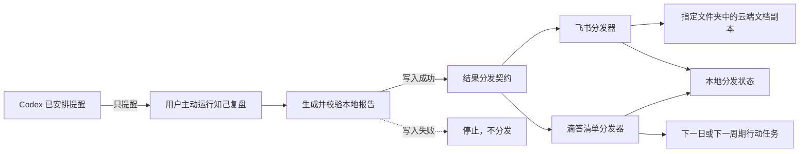

# 知己提醒与结果分发：第一性原理设计

## 结论

当前值得建设的不是一个“自动替用户复盘的 AI 工作流”，而是一条更短、更可靠的使用链路：

1. Codex 已安排任务只在约定时间提醒用户开始复盘；
2. 用户在知己中主动生成复盘或确认主题思考；
3. 本地权威文件成功写入并通过基本校验后，调用两个互不依赖的分发器；
4. 飞书分发器把完整 Markdown 导入指定云空间文件夹，作为便于阅读的云端副本；
5. 滴答清单分发器只把报告中已经形成的下一周期行动创建为任务；
6. 任一外部渠道失败都不回滚本地文件，也不阻止另一个渠道继续执行。

这条链路保留“用户决定何时思考、知己负责生成、本地负责保存事实、外部软件负责触达”的职责边界。

## 一、真实问题

知己已有日志、日反馈、周/月/项目/年度复盘、人生设计和主题思考等能力。当前摩擦不在“不会分析”，而在生成之后的触达：用户必须回到电脑和项目目录才能阅读报告、再手工把行动搬进任务工具。

需要消除的是两次重复劳动：

- 已生成的结果需要手工复制到日常使用的飞书；
- 已明确的行动需要手工改写并录入滴答清单。

定时提醒只解决“记得开始”，不解决“替用户判断和复盘”。如果让定时器直接生成报告，就会在用户尚未提供材料、尚未确认范围或不准备复盘时擅自运行，破坏知己以用户主动输入和证据边界为核心的产品原则。

## 二、事实、假设、约束与价值选择

### 已确认事实

- `.claude/` 是唯一产品运行真相；报告先写入 `paths.md` 定义的本地路径。
- 日反馈有唯一的 `⚡ 明天试试 / 行动：`；周报和月报有稳定的 `## 六、下周规划`、`## 六、下月规划`；项目、年度、人生设计和主题思考也有后续行动或实验区域。
- 用户使用 Codex 已安排任务、飞书和滴答清单，不使用 Hermes，也不把 Notion 作为沉淀渠道。
- 飞书只承担云端副本，不承担机器人对话；滴答只接收任务，不向知己回传完成情况。
- 用户接受“本地报告写入成功后，自动调用两个独立分发器”。

### 待用户后续提供或确认的外部条件

- 提醒种类、时间、时区和提醒文案；没有明确日程时不创建已安排任务。
- 飞书租户、应用配置、目标文件夹及当前用户访问权限。
- 滴答账号属于滴答清单中国区还是 TickTick 国际区、官方 MCP 的授权结果、目标清单名称。

这些条件只阻塞对应渠道的现场接入，不阻塞设计、代码契约和离线测试。

### 硬约束

- 本地写入是主事务；外部分发是可重试的后置副作用。
- 不上传原始日志、画像、中间视角分析、验证模式库或分发配置。
- 不读取滴答任务状态，不据此评估用户，不建立双向同步。
- 不在仓库、命令行参数、报告或状态文件中保存 App Secret、OAuth token 或 MCP token。
- 同一报告路径的同一内容不能重复创建飞书文档或滴答任务。
- 飞书与滴答必须分别记录结果；一个失败不能造成另一个被跳过。

### 价值选择

- 优先降低日常摩擦，而不是追求无人值守。
- 优先可解释、可停用、可补发，而不是“看起来全自动”。
- 优先官方受维护的适配层，而不是自行维护第三方 API 客户端。
- 优先少而清晰的行动任务；宁可不创建，也不把整篇建议拆成任务洪水。

## 三、参考教程的取舍

`AI agent 自动化工作流搭建教程.md` 值得借鉴的是架构思想，而不是原样照搬技术栈。

| 教程做法 | 本项目决策 | 原因 |
|---|---|---|
| 定时器自动启动分析 | 只发送提醒 | 复盘需要用户主动提供时机、范围和材料 |
| Notion 作为知识库 | 本地为权威，飞书为副本 | 避免双主数据源和额外 CRUD |
| Bridge 连接外部工具 | 保留两个窄分发器 | 隔离第三方变化和失败 |
| 从滴答读取完成状态 | 删除 | 用户明确不需要，且会增加错误判断和权限 |
| `.env` 保存凭证 | 改用飞书 CLI 凭证库与 MCP 授权存储 | 凭证不进入项目文件更安全 |
| 每层先手工验证 | 保留 | 能快速定位是本地、飞书还是滴答故障 |

## 四、目标架构



### 4.1 提醒层

Codex 已安排任务位于项目之外，只投递一条可执行提醒。例如：

> 现在是周志提醒。请打开知己并让我生成本周周志；不要自动开始复盘。

提醒不读取项目文件、不生成报告、不调用飞书或滴答。若运行本地任务需要电脑在线，也不能把“提醒成功”当作“复盘完成”。

### 4.2 本地权威层

沿用现有输出路径，不新增报告类型。只有同时满足以下条件才进入分发：

1. 调用方完成报告写入；
2. 目标文件存在、非空，并符合对应输出的最低结构；
3. 本次不是读取既有报告的快路径；
4. 本地配置已启用至少一个分发器。

主题思考仍先经过现有用户确认，确认写入后才可能分发。原始日志永不触发分发。

### 4.3 分发协调层

新增一份共享运行契约，定义触发、内容分类、幂等、错误和用户可见结果。协调层按同一输入分别调用飞书和滴答：

- 每个分发器单独执行、单独捕获错误、单独更新状态；
- 飞书失败后仍调用滴答，滴答失败也不改变飞书结果；
- 返回统一摘要，例如 `本地已保存；飞书成功；滴答创建 1 项`；
- 未配置时返回 `未配置，已跳过`，不把它伪装成失败；
- 外部失败时保留可补发状态，但不自动无限重试。

### 4.4 飞书分发器

推荐使用飞书官方维护的 `lark-cli`，不在知己中重写上传、导入任务和轮询逻辑。常规调用形态为：

```powershell
lark-cli drive +import --file <LOCAL_MD> --type docx --folder-token <FOLDER_TOKEN> --name <DOCUMENT_TITLE> --as bot
```

鉴权采用企业自建应用的应用身份。`tenant_access_token` 由官方 CLI 管理和刷新，不写入知己配置。应用以 `lark-cli drive +create-folder --name "知己" --as bot` 创建专用文件夹，用户获得该文件夹的访问权限。一次性配置阶段可以为了识别当前用户和授予权限完成用户授权，但日常导入仍使用应用身份；这里的 `bot` 是开放平台身份，不代表建设飞书聊天机器人。

同一飞书文件夹的导入串行执行。若导入返回异步 ticket，则按 CLI 返回的 `next_command` 查询最终结果。只记录远端 token、URL、状态和错误分类，不记录凭证。

### 4.5 滴答清单分发器

使用账号区域对应的官方 MCP，并只申请创建任务所需能力。运行时发现且仅绑定一个语义为“创建任务”的 MCP 操作；不存在或出现多个不明确候选时停止该渠道，提示配置，不猜工具名。

任务提取规则：

| 本地结果 | 任务来源 | 上限 | 截止时间 |
|---|---|---:|---|
| 日反馈 | `⚡ 明天试试` 下唯一 `行动：` | 1 | 次日 |
| 周报 | `## 六、下周规划` 中清晰、可检查的行动 | 3 | 下一周周日；报告明确日期优先 |
| 月报 | `## 六、下月规划` 中清晰、可检查的行动 | 3 | 下一月末；报告明确日期优先 |
| 项目复盘 | 后续规划中有明确动作和检查条件的项目项 | 3 | 只用报告明确日期，否则无截止日 |
| 年度/人生设计 | 明确的近期实验，不创建宽泛方向 | 3 | 只用报告明确日期，否则无截止日 |
| 已确认主题思考 | `0. 当前行动卡` 中当前最小行动 | 3 | 只用正文明确日期，否则无截止日 |

任务标题保留动作本身；描述写入本地来源路径、周期和检查条件。无法提取明确动作时返回 `无合格行动，已跳过`，不让模型为了同步而发明任务。

### 4.6 配置与状态

非敏感配置放在被 git 忽略的 `复盘/.result-distribution-config.json`，至少包含启用开关、飞书文件夹 token、滴答账号区域和目标清单名。仓库只提供不含真实 token 的示例配置。

幂等状态放在 `复盘/.result-distribution-state.json`。逻辑主键是本地报告相对路径，内容指纹使用 SHA-256：

- 同一路径、同一指纹、某渠道已成功：该渠道跳过；
- 同一路径、同一指纹、某渠道失败：只允许显式补发或下一次正常写入时有限重试；
- 同一路径内容发生变化：不静默覆盖既有飞书副本或重复创建任务，标记 `changed_after_delivery` 并提示用户显式确认重新分发；
- 状态损坏：隔离损坏文件、按空状态继续，但不得删除远端内容。

该保守策略牺牲“重跑后立即覆盖云端”的便利，换取不重复建任务、不覆盖用户可能已经批注的云文档。真实使用证明需要自动更新后，再单独设计远端更新语义。

## 五、失败语义与用户体验

最终消息始终先说明本地结果：

```text
本地已保存：复盘/每周复盘/2026-W33.md
飞书：已同步（知己/每周复盘/2026-W33）
滴答：已创建 2 项任务
```

部分失败时：

```text
本地已保存：复盘/每周复盘/2026-W33.md
飞书：失败（权限不足，可补发）
滴答：已创建 2 项任务
```

不得使用“整体失败”，因为本地成果已经存在。不得把完整第三方错误堆栈写入个人报告；聊天中只给分类和下一步，详细诊断留在本地状态。

## 六、被排除的方案

### 全自动定时复盘

排除。它把提醒误当执行，会在证据、时机或用户意愿不足时生成内容。

### 飞书机器人或飞书作为主数据源

排除。用户不需要在飞书中对话，也不需要从飞书回写；双主数据源会引入冲突合并和权限治理。

### 直接自研飞书 REST 客户端

暂不采用。官方 CLI 已封装 Markdown 导入、轮询、身份和权限提示，自研没有提供当前必要的额外价值。

### 读取滴答完成状态形成闭环

排除。它不解决当前的手工录入问题，并会引入读取权限、任务匹配和错误归因。

### 先引入队列、数据库或常驻服务

排除。当前是单用户、低频、写后触发场景，本地 JSON 状态足以验证价值。只有出现并发丢失或大量待补发证据后才考虑队列。

## 七、最小验证闭环

按三个阶段验证，不一次性扩大范围：

1. 提醒试点：创建一个明确日程的周志提醒，验证它只提醒、不自动复盘。
2. 飞书试点：用一份脱敏测试 Markdown 导入专用文件夹，验证标题、格式、权限和重复保护。
3. 滴答试点：从一份日反馈创建唯一原子行动，验证清单、标题、描述、截止日和重复保护。

随后用三次真实分发观察：是否仍需手工搬运、是否产生重复、任务是否过多、外部失败是否影响本地报告。没有这些证据前，不增加回读、双向同步、后台队列或更多渠道。

## 八、用户后续需要提供的内容

进入接入阶段时一次性提供或确认：

- Codex：每一种提醒的名称、频率、具体时间、时区和提醒文案；
- 飞书：是否有企业/团队租户管理权限，专用自建应用的配置配合，目标文件夹名称或链接，期望自己拥有查看还是可管理权限；
- 滴答：滴答清单中国区或 TickTick 国际区、完成官方 MCP 授权、目标清单名称；
- 策略：是否启用日反馈、周报、月报、项目复盘、年度、人生设计和已确认主题思考各自的飞书/滴答开关。

不需要把 App Secret、access token 或 MCP token 粘贴到聊天或仓库。需要浏览器授权时，由接入步骤生成当次授权链接，用户在官方页面完成。

## 九、验收标准

- 已安排任务只提醒，不读取或生成复盘。
- 未成功写入本地文件时，两个分发器都不运行。
- 飞书只收到允许的完整结果文件，且位于指定文件夹。
- 滴答只收到报告中已有的合格行动，不读取任何任务状态。
- 同一内容重复运行不会产生重复文档或任务。
- 飞书失败不阻塞滴答，滴答失败不影响飞书，本地结果永远保留。
- 仓库和本地状态中没有第三方密钥。
- 未配置任一渠道时，知己仍可完整执行原有本地流程。

## 参考资料

- 本项目参考：`AI agent 自动化工作流搭建教程.md`
- 飞书官方 CLI：https://github.com/larksuite/cli
- 飞书官方 Markdown 导入说明：https://github.com/larksuite/cli/blob/main/skills/lark-drive/references/lark-drive-import.md
